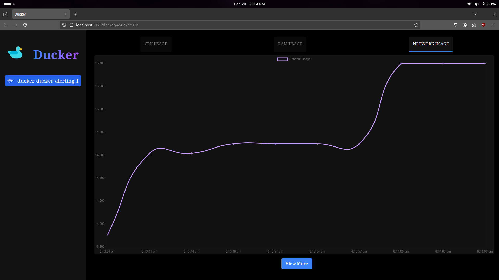

# Ducker  

This project is a comprehensive solution for monitoring Docker containers. It displays running Docker containers and their stats and logs on a user-friendly frontend interface.

## Technologies Used

- **Backend**: NestJs and Docker Engine API
- **Frontend**: ReactJs with Chart.js for charts

## Features

- Display running Docker containers
- Show real-time stats of each container
- View logs of each container
- Visualize stats with interactive charts

## Getting Started

These instructions will get you a copy of the project up and running on your local machine for development and testing purposes.

### Prerequisites

- Docker
- Node.js
- npm

### Installation

#### 1. Clone the repository
```bash
git clone https://github.com/harshau007/ducker.git
```

#### 2. Install NPM packages
```bash
npm run install:frontend      # for frontend
      &
npm run install:backend       # for backend
```

#### 3. Start the application
```bash
npm run start:frontend      # for frontend
      &
npm run start:backend       # for backend
```


## Usage

Open your web browser and navigate to `http://localhost:3000` to view the application.

## Contributing

Contributions are what make the open-source community such an amazing place to learn, inspire, and create. Any contributions you make are greatly appreciated.

1. Fork the Project
2. Create your Feature Branch (`git checkout -b feature/AmazingFeature`)
3. Commit your Changes (`git commit -m 'Add some AmazingFeature'`)
4. Push to the Branch (`git push origin feature/AmazingFeature`)
5. Open a Pull Request

## License

Distributed under the MIT License. See `LICENSE` for more information.

## Contact

Harsh Upadhyay - amanupadhyay2004@gmail.com

Project Link: https://github.com/harshau007/ducker

## Teammates

This project is the result of the hard work and dedication of a team of talented individuals. Here are the contributors to this project:

- [Harsh Upadhyay](https://github.com/harshau007) - Backend Developer
- [Amir Kamal](https://github.com/0amirk) - Frontend Developer
- [Aman Sharma](https://github.com/harshau007) - Frontend Developer
- [Dhiraj Kalwar](https://github.com/dhirajkalwar) - Frontend Developer
